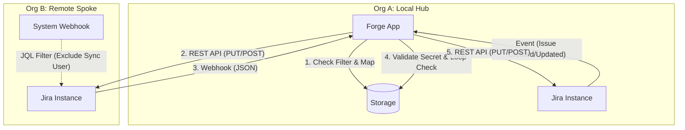
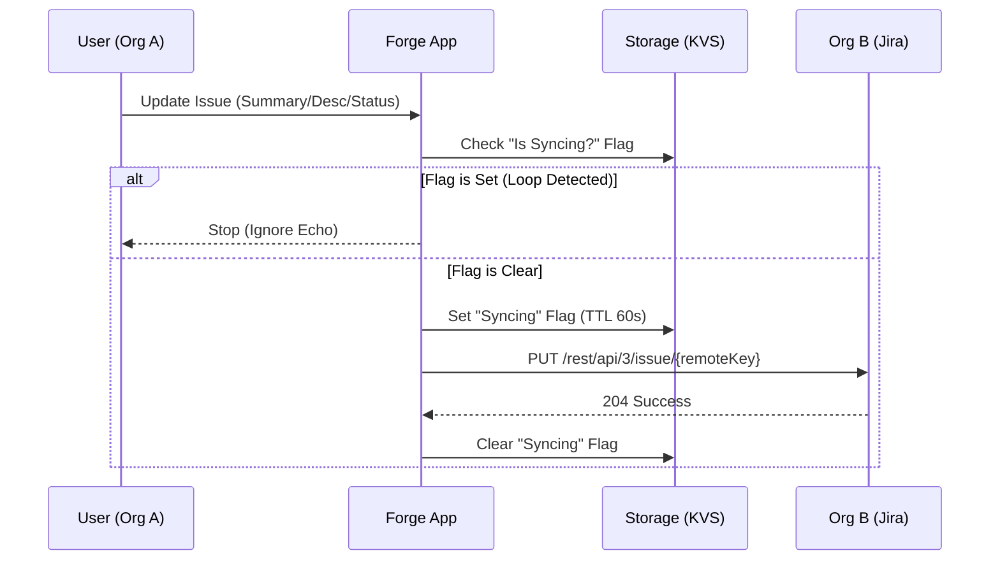
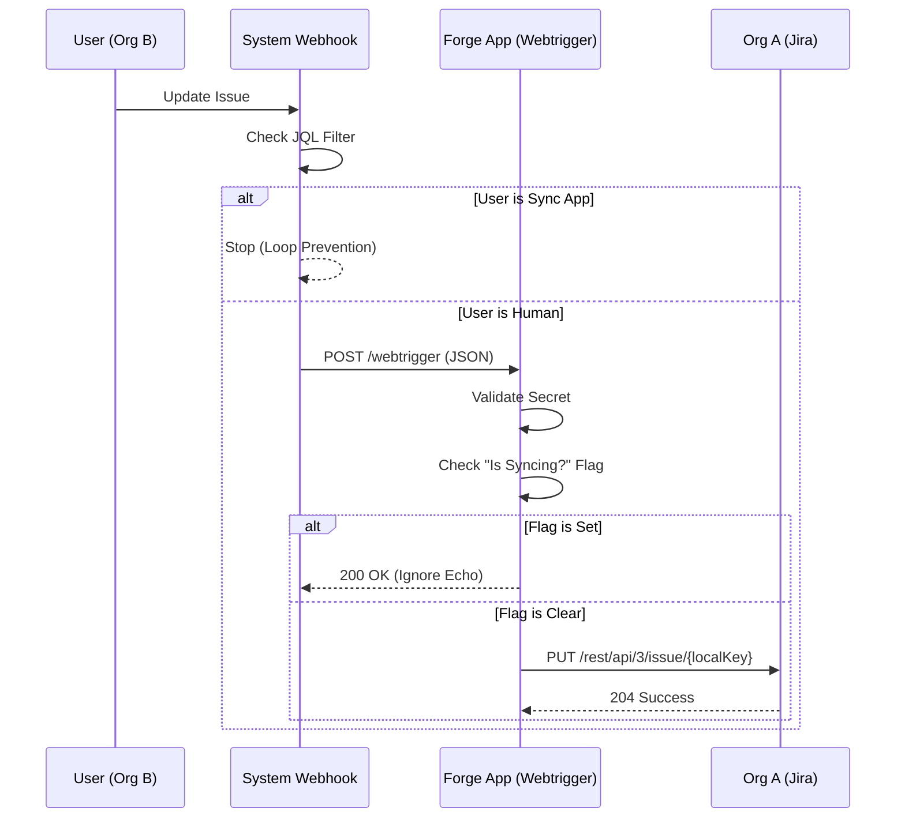

# Two-Way Sync Flow & Behavior Guide

This document details the visual flow and behavior of the Two-Way Sync system between **Org A (Local/Hub)** and **Org B (Remote/Spoke)**.

## 1. High-Level Architecture

The system uses a **Hub-and-Spoke** model. Org A (where the app is installed) acts as the central hub. Org B is a passive participant that uses standard Jira Webhooks to communicate back to Org A.

---

## 2. Setup & Handshake Process

Before sync can occur, a secure connection must be established.

### Step 1: Org A Configuration
1.  **Admin A** installs the app.
2.  **Admin A** creates an Organization entry for Org B.
3.  **Admin A** sets "Sync Direction" to **Two-Way (Bidirectional)**.
4.  **App** generates a unique `Incoming Webhook URL` and `Secret`.

### Step 2: Org B Configuration (Manual Handshake)
1.  **Admin A** shares the `Incoming Webhook URL` and `JQL Filter` with **Admin B**.
2.  **Admin B** creates a **System Webhook** in Org B's Jira settings.
    *   **URL**: `<Incoming Webhook URL>?secret=<Secret>`
    *   **JQL**: `project = "SHARED" AND creator != "sync_user" AND updatedBy != "sync_user"`
    *   **Events**: Issue Created, Updated, Deleted.
3.  **Admin B** creates an **API Token** and shares it with **Admin A**.
4.  **Admin A** enters the API Token into the App configuration.

---

## 3. Sync Lifecycle: Outgoing (Org A → Org B)

When a user in Org A updates an issue, the app pushes changes to Org B.

### Entity Support (Outgoing)

| Entity | Behavior | Notes |
| :--- | :--- | :--- |
| **Fields** | Syncs Summary, Description, Priority, Assignee. | Assignee requires email mapping. |
| **Status** | Syncs Transitions. | Requires matching transition names (e.g., "Done" → "Done"). |
| **Comments** | Syncs all comments. | Adds header: `[Comment from Org A - User: Serdar]` |
| **Attachments** | Syncs all attachments. | Replaces media IDs in description to fix broken images. |
| **Links** | Syncs "Blocks", "Relates to", etc. | Queues links if the target issue doesn't exist yet. |
| **Subtasks** | Syncs Parent/Child relationship. | Recursively syncs parent if missing (up to depth 1). |
| **Epics** | Syncs Epic Link. | Recursively syncs Epic if missing. |

---

## 4. Sync Lifecycle: Incoming (Org B → Org A)

When a user in Org B updates an issue, Org B sends a webhook to Org A.

### Entity Support (Incoming - Current MVP)

| Entity | Behavior | Notes |
| :--- | :--- | :--- |
| **Fields** | Syncs Summary, Description. | **Limitation**: Does not yet sync Priority/Assignee. |
| **Status** | **Not Synced** | Status changes in Org B do not reflect in Org A yet. |
| **Comments** | **Not Synced** | Comments added in Org B do not appear in Org A yet. |
| **Attachments** | **Not Synced** | Attachments added in Org B do not appear in Org A yet. |
| **Links** | **Not Synced** | Link changes in Org B do not reflect in Org A yet. |
| **Creation** | **Supported** | Creating an issue in Org B creates it in Org A (Target Project). |
| **Deletion** | **Supported** | Deleting an issue in Org B deletes it in Org A. |

---

## 5. Loop Prevention Strategy

The system uses a **Defense-in-Depth** approach to prevent infinite sync loops.

### Layer 1: Source Filtering (The Firewall)
*   **Mechanism**: The JQL Filter in Org B's Webhook configuration.
*   **Rule**: `... AND updatedBy != "sync_user_account_id"`
*   **Effect**: Org B **never** sends a webhook for a change that Org A just made. This stops the loop before it starts.

### Layer 2: Internal Flags (The Safety Net)
*   **Mechanism**: `isSyncing` flag in Forge Storage.
*   **Rule**: Before writing to Jira, the app sets a flag `syncing:ISSUE-123`.
*   **Effect**: If Layer 1 fails and a webhook comes back, the app sees the flag and ignores the request.

---

## 6. Conflict Resolution

*   **Strategy**: "Last Write Wins"
*   **Logic**: The system assumes that the most recent event (whether from Org A or Org B) represents the current truth.
*   **Latency**: Webhooks typically arrive within 1-3 seconds. Race conditions are rare but possible; the `isSyncing` flag helps mitigate them by locking the issue during active sync operations.
